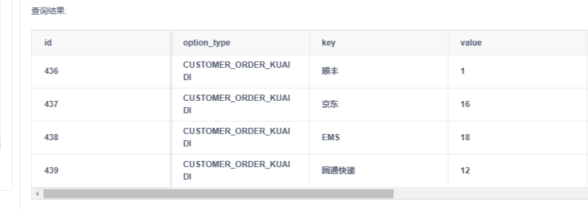

# ty工单

## 目录

-   [顺丰发货assign\_delivery\_item\_id=1](#顺丰发货assign_delivery_item_id1)
-   [恢复订单金额](#恢复订单金额)
-   [解绑](#解绑)

```sql
update  user_share set deleted_time = now()
WHERE user_id in (9011947,9011876)


```

## 顺丰发货assign\_delivery\_item\_id=1



```typescript
update customer_order set  customer_order.express_number = 'SF1431826065583',customer_order.order_status = 5,customer_order.shipping_time = now(),customer_order.shipping_status = 3
where id = 2030815
```

&#x20;`${CommonStatic.REDIS_MENU_LIST_STARTS_WITH}${req.employeeInfo.id}`,

## 恢复订单金额

9010104缅达欣瑞  2028898，小谷这个单帮我恢复一下金额，总金额1983  实收金额1480，定金1480，代收0

```sql
update customer_order set order_amount = 1983,real_collect_amount = 1480,deposit_money = 1480 where id = 2028898;
```

&#x20;9010420 高永 2029612，这个帮我恢复发货状态，点错签收了

```sql
update customer_order set order_status = 5
where id = 2029612;
```

```sql
SELECT user.emerg_phone FROM user 
WHERE user.emerg_phone is not null and user.emerg_phone != ''
and user.emerg_phone in (
  SELECT user.other_phone FROM user 
  WHERE user.other_phone is not null and user.other_phone != ''
)

SELECT user.mobile FROM user 
WHERE user.mobile is not null and user.mobile != '' and user.deleted_time is null 
and user.mobile in (
  SELECT user.emerg_phone FROM user 
  WHERE user.emerg_phone is not null and user.emerg_phone != '' and user.deleted_time is null 
)


SELECT user.mobile FROM user 
WHERE user.mobile is not null and user.mobile != ''
and user.mobile in (
  SELECT user.other_phone FROM user 
  WHERE user.other_phone is not null and user.other_phone != ''
)

```

```typescript
update customer_order set  customer_order.app_time = now()
where id = 2036080;

update customer_order set  customer_order.app_time = now()
where id = 2036083;

update customer_order set  customer_order.app_time = now()
where id = 2036087;


update customer_order set  customer_order.app_time = now()
where id = 2036148;

update customer_order set  customer_order.app_time = now()
where id = 2036158;

update customer_order customer_order.app_time = now()
where id = 2036198;

update customer_order set  customer_order.app_time = now()
where id = 2036105;

update customer_order set  customer_order.app_time = now()
where id in (2036045);

```

## 解绑

```typescript
update call_user_setting set emp_id = null,emp_name = null 
where agent_num in(8480)
```
